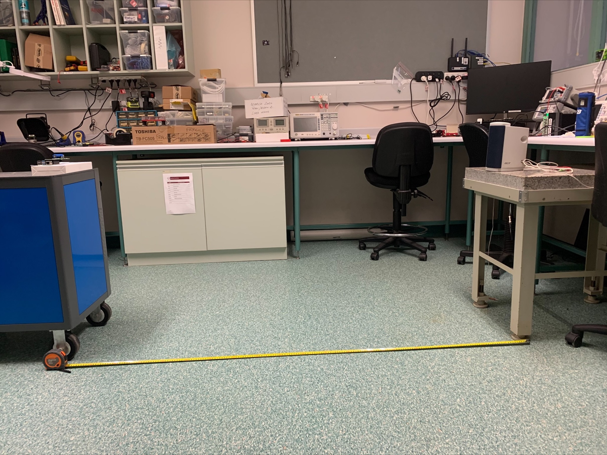
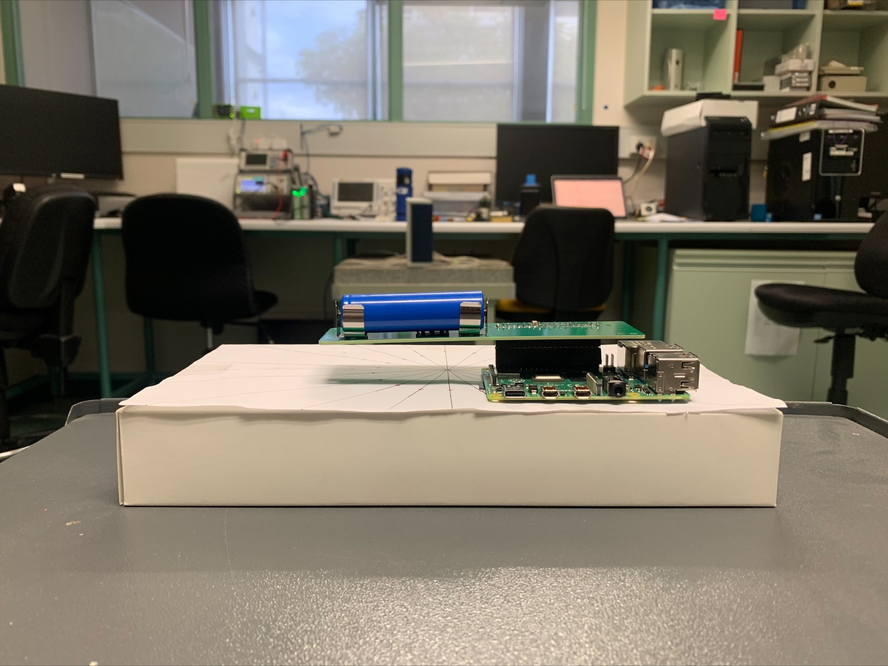
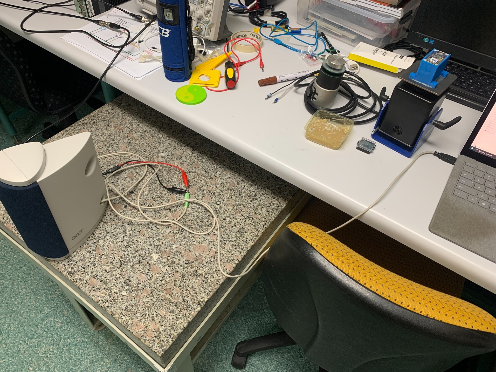
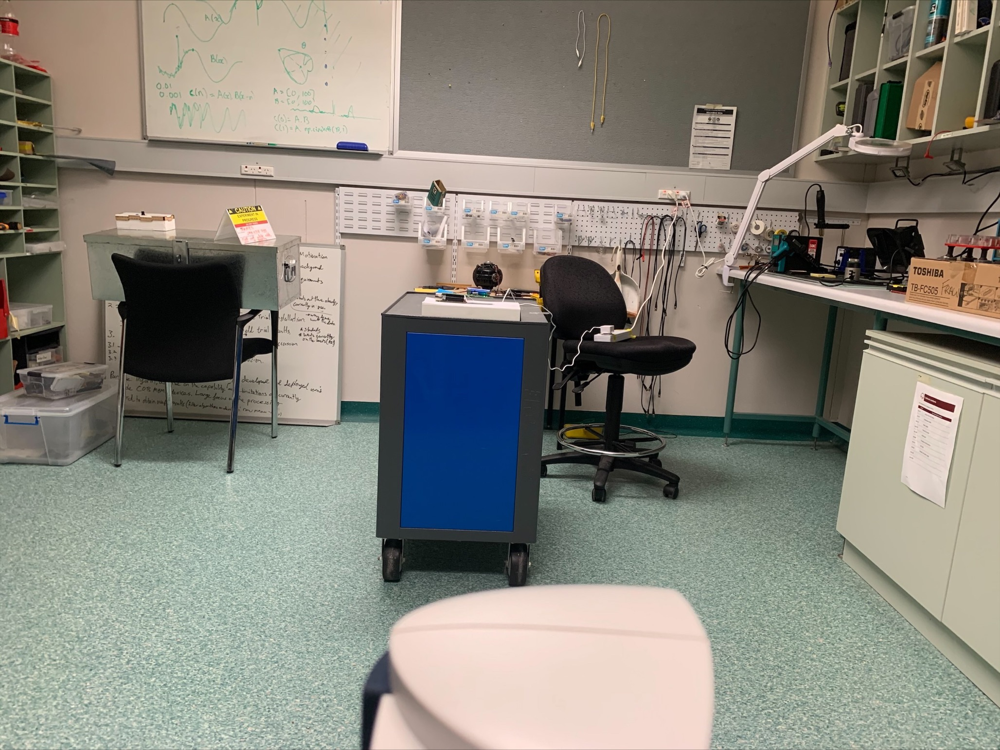
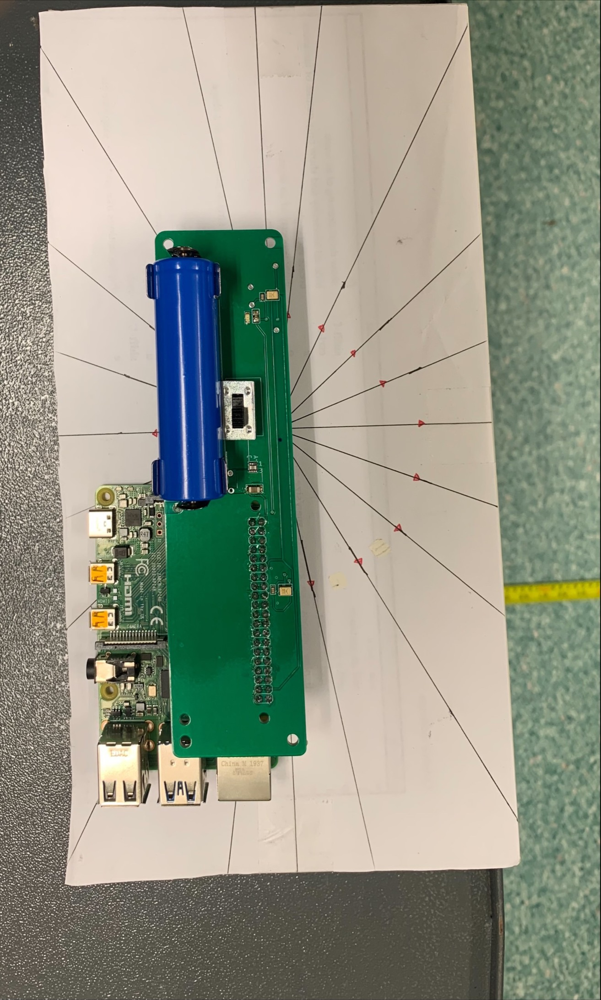

# Time domain beamforming

This project started out as a way to visualise time-domain beamforming
for a simple idealised linear array in two dimensions.

It has now evolved into a way to compare experimental results with
theoretical results for a series of experiments using a two-element
linear array.

The URL for this repository is 
https://github.com/uwasystemhealth/time_domain_beamforming

The URL for the development of the experimental microphone array is
https://github.com/uwasystemhealth/VM3000-Microphones

## Notes on experiment

Ricky Leman has added 2 sets of experimental data onto the real-data 
branch of the time_domain_beamforming repository. 

Pi4_Sine_Sweeps consist of 20 wav files with the naming convention: 
`Pi4sweepTest_[Array to speaker distance]_[Array angle with 0 directly perpendicular to speaker]_[start frequency]_[end frequency]_[duration].wav`
There are 2 extra wav files at 90 degrees and 270 degrees so the beampattern can be plotted for the endfire direction.

Pi4_Sine_SweepBursts consists of 18 wav files with the naming convention:
`Pi4sineSweepBurstTest_[Array to speaker distance]_[Array angle with 0 directly perpendicular to speaker]_[start frequency]_[end frequency]_[frequency step size]_[duration].wav`
I have not taken measurements for the 90 degree and 270 degree angle in this set of data. 

Note that it seems like the single battery did not provide enough juice
for the Pi4's Wi-Fi to properly activate/connect to the SHL network, 
hence why I had to power the Pi4 using the cable. 
